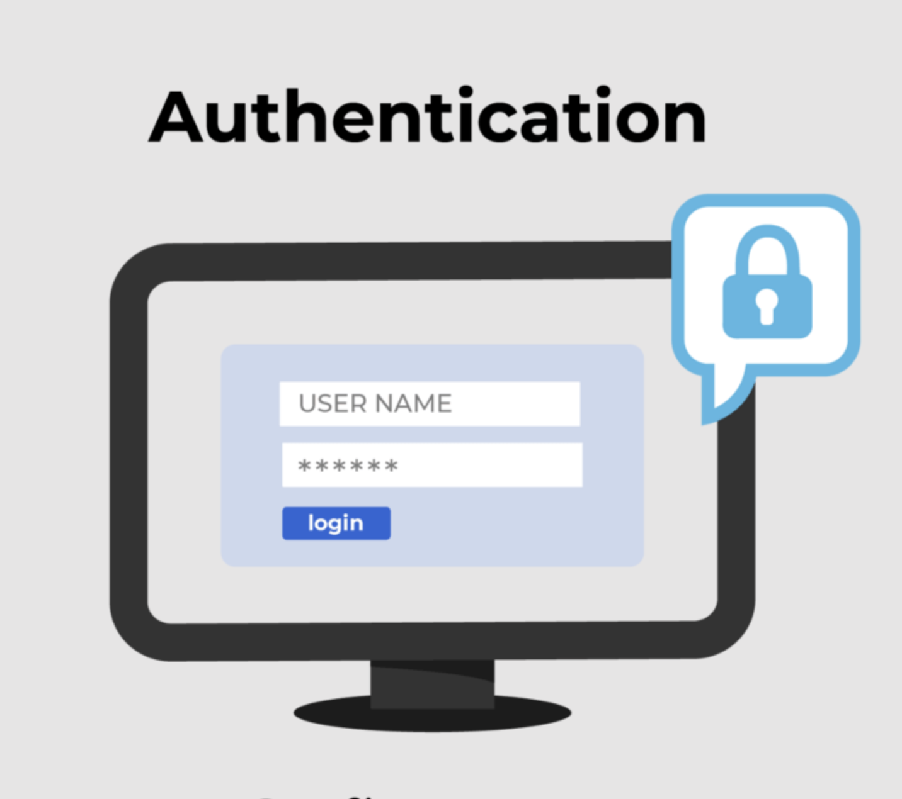

# 🛡️ Authentication và Authorization trong Node.js

Authentication (xác thực) và Authorization (ủy quyền) là hai khái niệm cốt lõi trong bảo mật ứng dụng. Trong bài này, chúng ta sẽ tìm hiểu:

1. Authentication và Authorization là gì?
2. Cookie và Session Authentication.
3. JSON Web Token (JWT): Giải thích và demo.
4. Lưu JWT ở đâu: localStorage hay cookie?
5. Ứng dụng với Node.js.


## 1. Authentication và Authorization là gì?

### Authentication (Xác thực)

**Authentication** là quá trình xác minh danh tính của người dùng hoặc hệ thống.  
Nó trả lời câu hỏi: **"Bạn là ai?"**

Ví dụ: Một sinh viên hoặc giảng viên muốn vào lớp học. Họ cần xuất trình thẻ sinh viên hoặc thẻ giảng viên để chứng minh danh tính của mình.  
Nếu thẻ hợp lệ, họ được phép vào lớp.



> **Hình minh họa**: Luồng hoạt động của Authentication.

### Authorization (Ủy quyền)

**Authorization** là quá trình xác định quyền truy cập của người dùng hoặc hệ thống.  
Nó trả lời câu hỏi: **"Bạn được phép làm gì?"**

Ví dụ:  
- Sinh viên được phép tham gia lớp học, nghe giảng, và làm bài tập.  
- Giảng viên không chỉ được phép vào lớp học mà còn có quyền giảng bài, quản lý danh sách sinh viên, và chấm điểm.

> **Điểm khác biệt**: Mặc dù cả sinh viên và giảng viên đều được xác thực để vào lớp học, nhưng quyền hạn của họ khác nhau.


## 2. Cookie và Session Authentication

### Cookie là gì?

**Cookie** là một tệp nhỏ được lưu trữ trên trình duyệt của người dùng. Nó được sử dụng để lưu trữ thông tin như phiên đăng nhập, tùy chọn người dùng, hoặc các dữ liệu khác.

### Session là gì?

**Session** là một phiên làm việc giữa người dùng và máy chủ. Thông tin phiên thường được lưu trên máy chủ và được liên kết với người dùng thông qua một cookie chứa ID phiên.

### Cách hoạt động của Cookie và Session Authentication:

1. Người dùng đăng nhập bằng tên người dùng và mật khẩu.
2. Máy chủ xác thực thông tin và tạo một session trên máy chủ.
3. Máy chủ gửi một cookie chứa ID phiên về trình duyệt.
4. Trình duyệt gửi cookie này trong các yêu cầu tiếp theo để xác định người dùng.

#### Ưu điểm:

- Dễ triển khai.
- Bảo mật hơn nếu cookie được mã hóa và sử dụng HTTPS.

#### Nhược điểm:

- Phụ thuộc vào máy chủ để lưu trữ session.
- Không phù hợp cho các ứng dụng phân tán (distributed systems).


## 3. JSON Web Token (JWT)

### JWT là gì?

**JWT (JSON Web Token)** là một tiêu chuẩn mở để truyền thông tin giữa các bên dưới dạng JSON. JWT được mã hóa và ký để đảm bảo tính toàn vẹn và xác thực.

### Cấu trúc của JWT:

JWT bao gồm 3 phần, được phân tách bởi dấu chấm (`.`):

1. **Header**: Chứa thông tin về thuật toán mã hóa.
2. **Payload**: Chứa dữ liệu (ví dụ: userId, role).
3. **Signature**: Được tạo bằng cách ký Header và Payload với một khóa bí mật.

Ví dụ:

```
eyJhbGciOiJIUzI1NiIsInR5cCI6IkpXVCJ9
.
eyJ1c2VySWQiOiIxMjM0NTY3ODkwIiwicm9sZSI6ImFkbWluIn0
.
SflKxwRJSMeKKF2QT4fwpMeJf36POk6yJV_adQssw5c
```

### Cách hoạt động của JWT:

1. Người dùng đăng nhập và máy chủ tạo một JWT chứa thông tin người dùng.
2. JWT được gửi về trình duyệt và lưu trữ (trong cookie hoặc localStorage).
3. Trình duyệt gửi JWT trong các yêu cầu tiếp theo.
4. Máy chủ xác minh JWT để xác thực người dùng.


### Demo: Sử dụng JWT trong Node.js

#### Tạo JWT:

```javascript
const jwt = require('jsonwebtoken');

const user = { id: 1, role: 'admin' };
const secretKey = 'yourSecretKey';

// Tạo token
const token = jwt.sign(user, secretKey, { expiresIn: '1h' });
console.log('JWT:', token);
```

#### Xác thực JWT:

```javascript
function authenticateToken(req, res, next) {
  const token = req.headers['authorization'];
  if (!token) return res.status(401).send('Access Denied');

  jwt.verify(token, 'yourSecretKey', (err, user) => {
    if (err) return res.status(403).send('Invalid Token');
    req.user = user;
    next();
  });
}
```


## 4. Lưu JWT ở đâu: localStorage hay cookie?

### Lưu trong localStorage:

- **Ưu điểm**:
  - Dễ sử dụng.
  - Không gửi tự động trong mỗi yêu cầu.

- **Nhược điểm**:
  - Dễ bị tấn công XSS (Cross-Site Scripting).

### Lưu trong cookie:

- **Ưu điểm**:
  - Có thể bảo vệ bằng cách sử dụng `HttpOnly` và `Secure`.
  - Tự động gửi trong mỗi yêu cầu.

- **Nhược điểm**:
  - Dễ bị tấn công CSRF (Cross-Site Request Forgery).

> **Khuyến nghị**: Sử dụng cookie với các thuộc tính bảo mật (`HttpOnly`, `Secure`) để lưu JWT.


## 5. Ứng dụng Authentication và Authorization trong Node.js

### Authentication:

```javascript
const express = require('express');
const jwt = require('jsonwebtoken');

const app = express();
app.use(express.json());

const secretKey = 'yourSecretKey';

// Đăng nhập và tạo JWT
app.post('/login', (req, res) => {
  const { username, password } = req.body;

  // Kiểm tra thông tin đăng nhập (giả sử đúng)
  const user = { id: 1, username, role: 'admin' };
  const token = jwt.sign(user, secretKey, { expiresIn: '1h' });

  res.json({ token });
});
```

### Authorization:

```javascript
function authorizeRoles(...roles) {
  return (req, res, next) => {
    if (!roles.includes(req.user.role)) {
      return res.status(403).send('Access Denied');
    }
    next();
  };
}

// Sử dụng middleware
app.get('/admin', authenticateToken, authorizeRoles('admin'), (req, res) => {
  res.send('Welcome Admin');
});
```


## 6. Tóm tắt nhanh

| **Khái niệm**      | **Mục đích**                                      | **Ứng dụng trong Node.js**                              |
|---------------------|--------------------------------------------------|--------------------------------------------------------|
| **Authentication** | Xác minh danh tính người dùng.                   | Passport.js, JWT, bcrypt.                              |
| **Authorization**  | Xác định quyền truy cập của người dùng.          | Phân quyền dựa trên vai trò hoặc quyền (RBAC, PBAC).   |
| **JWT**            | Truyền thông tin xác thực giữa các bên.           | Sử dụng để xác thực không trạng thái (stateless).      |


Authentication và Authorization là hai thành phần không thể thiếu trong bảo mật ứng dụng. Trong Node.js, chúng ta có thể sử dụng các thư viện mạnh mẽ như Passport.js và JWT để triển khai các cơ chế này một cách hiệu quả.


## 7. Sự khác nhau giữa JWT, Cookie và Session-based Authentication

### Ví dụ minh họa: Sinh viên gửi xe

Hãy tưởng tượng một sinh viên đến trường và gửi xe. Ông bảo vệ sẽ xử lý theo 3 cách khác nhau:

1. **Session-based Authentication**:
   - Ông bảo vệ ghi thông tin xe (biển số, thời gian gửi) vào sổ (tương tự như lưu session trên máy chủ).
   - Sau đó, ông đưa cho sinh viên một vé xe (tương tự như cookie chứa session ID).
   - Khi sinh viên quay lại lấy xe, ông kiểm tra vé xe và đối chiếu với thông tin trong sổ.

2. **Cookie-based Authentication**:
   - Ông bảo vệ không lưu thông tin xe vào sổ.
   - Thay vào đó, ông ghi toàn bộ thông tin xe (biển số, thời gian gửi) lên vé xe và đưa cho sinh viên (tương tự như cookie chứa thông tin người dùng).
   - Khi sinh viên quay lại, ông chỉ cần đọc thông tin trên vé xe để xác minh.

3. **JWT-based Authentication**:
   - Ông bảo vệ tạo một vé xe đặc biệt (JWT), trong đó thông tin xe được mã hóa và ký bằng một khóa bí mật.
   - Vé xe này được đưa cho sinh viên.
   - Khi sinh viên quay lại, ông bảo vệ kiểm tra tính hợp lệ của vé bằng cách giải mã và xác minh chữ ký, mà không cần lưu trữ thông tin xe ở đâu cả.


### Ưu và nhược điểm

| **Phương pháp**          | **Ưu điểm**                                                                 | **Nhược điểm**                                                                 |
|---------------------------|-----------------------------------------------------------------------------|--------------------------------------------------------------------------------|
| **Session-based**         | - Dữ liệu được lưu trên máy chủ, an toàn hơn.                              | - Phụ thuộc vào máy chủ, không phù hợp cho hệ thống phân tán.                  |
|                           | - Dễ quản lý và hủy bỏ session.                                            | - Tốn tài nguyên máy chủ để lưu trữ session.                                   |
| **Cookie-based**          | - Không cần lưu trữ trên máy chủ.                                          | - Dễ bị tấn công XSS nếu không bảo vệ tốt.                                     |
|                           | - Tự động gửi trong mỗi yêu cầu HTTP.                                      | - Dữ liệu có thể bị chỉnh sửa nếu không sử dụng `HttpOnly` và `Secure`.        |
| **JWT-based**             | - Không trạng thái (stateless), phù hợp cho hệ thống phân tán.             | - Không thể hủy bỏ token sau khi phát hành (trừ khi sử dụng danh sách đen).    |
|                           | - Không cần lưu trữ trên máy chủ.                                          | - Token có thể lớn, làm tăng kích thước yêu cầu HTTP.                          |


### Kết luận

- **Session-based Authentication** phù hợp cho các ứng dụng nhỏ hoặc nội bộ, nơi máy chủ có thể quản lý tất cả các phiên.
- **Cookie-based Authentication** đơn giản và dễ triển khai, nhưng cần bảo vệ cookie cẩn thận.
- **JWT-based Authentication** là lựa chọn tốt cho các hệ thống phân tán hoặc microservices, nhưng cần cân nhắc về bảo mật và quản lý vòng đời token.

**Happy coding các em!** ✨  
— **Thầy Đạt 🧡**
